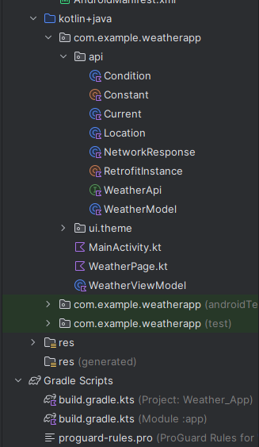

### MainActivity.kt

```kotlin
package com.example.weatherapp

import android.os.Bundle
import androidx.activity.ComponentActivity
import androidx.activity.compose.setContent
import androidx.activity.enableEdgeToEdge
import androidx.compose.foundation.layout.fillMaxSize
import androidx.compose.foundation.layout.padding
import androidx.compose.material3.MaterialTheme
import androidx.compose.material3.Scaffold
import androidx.compose.material3.Surface
import androidx.compose.material3.Text
import androidx.compose.runtime.Composable
import androidx.compose.ui.Modifier
import androidx.compose.ui.tooling.preview.Preview
import androidx.lifecycle.ViewModelProvider
import com.example.weatherapp.ui.theme.WeatherAppTheme

class MainActivity : ComponentActivity() {
    override fun onCreate(savedInstanceState: Bundle?) {
        super.onCreate(savedInstanceState)
        enableEdgeToEdge()
        val weatherViewModel = ViewModelProvider(this)[WeatherViewModel::class.java]

        setContent {
            WeatherAppTheme {
                Surface(modifier = Modifier.fillMaxSize(),
                    color = MaterialTheme.colorScheme.background){
                    WeatherPage(weatherViewModel)
                }
            }
        }
    }
}

@Composable
fun Greeting(name: String, modifier: Modifier = Modifier) {
    Text(
        text = "Hello $name!",
        modifier = modifier
    )
}

@Preview(showBackground = true)
@Composable
fun GreetingPreview() {
    WeatherAppTheme {
        Greeting("Android")
    }
}
```

### WeatherViewModel.kt

```kotlin
package com.example.weatherapp

import android.util.Log
import androidx.lifecycle.LiveData
import androidx.lifecycle.MutableLiveData
import androidx.lifecycle.ViewModel
import androidx.lifecycle.viewModelScope
import com.example.weatherapp.api.Constant
import com.example.weatherapp.api.NetworkResponse
import com.example.weatherapp.api.RetrofitInstance
import com.example.weatherapp.api.WeatherModel
import kotlinx.coroutines.launch
import retrofit2.Response

class WeatherViewModel: ViewModel() {

    private val weatherApi = RetrofitInstance.weatherApi
    private val _weatherResult = MutableLiveData<NetworkResponse<WeatherModel>>()
    val weatherResult: MutableLiveData<NetworkResponse<WeatherModel>> = _weatherResult

    fun getData(city: String){
        _weatherResult.value = NetworkResponse.Loading
        viewModelScope.launch {
            try{
                val response = weatherApi.getWeather(Constant.apiKey,city)
                if(response.isSuccessful){
//                Log.i("response: ",response.body().toString())
                    response.body()?.let {
                        _weatherResult.value = NetworkResponse.Success(it)
                    }

                }else{
//                Log.i("error: ",response.body().toString())
                    _weatherResult.value = NetworkResponse.Error("failed to load data")
                }
            }
            catch (e: Exception){
                _weatherResult.value = NetworkResponse.Error("failed to load data")
            }
        }
    }
}
```


### WeatherPage.kt

```kotlin
package com.example.weatherapp

import androidx.compose.foundation.layout.Arrangement
import androidx.compose.foundation.layout.Column
import androidx.compose.foundation.layout.Row
import androidx.compose.foundation.layout.Spacer
import androidx.compose.foundation.layout.fillMaxSize
import androidx.compose.foundation.layout.fillMaxWidth
import androidx.compose.foundation.layout.height
import androidx.compose.foundation.layout.padding
import androidx.compose.foundation.layout.size
import androidx.compose.foundation.layout.width
import androidx.compose.material.icons.Icons
import androidx.compose.material.icons.filled.LocationOn
import androidx.compose.material.icons.filled.Search
import androidx.compose.material3.Card
import androidx.compose.material3.CircularProgressIndicator
import androidx.compose.material3.Icon
import androidx.compose.material3.IconButton
import androidx.compose.material3.OutlinedTextField
import androidx.compose.material3.Text
import androidx.compose.runtime.Composable
import androidx.compose.runtime.getValue
import androidx.compose.runtime.livedata.observeAsState
import androidx.compose.runtime.mutableStateOf
import androidx.compose.runtime.remember
import androidx.compose.runtime.setValue
import androidx.compose.ui.Alignment
import androidx.compose.ui.Modifier
import androidx.compose.ui.graphics.Color
import androidx.compose.ui.text.font.FontWeight
import androidx.compose.ui.text.style.TextAlign
import androidx.compose.ui.unit.dp
import androidx.compose.ui.unit.sp
import coil3.compose.AsyncImage
import com.example.weatherapp.api.NetworkResponse
import com.example.weatherapp.api.WeatherModel

@Composable
fun WeatherPage(viewModel: WeatherViewModel){

    var city by remember {
        mutableStateOf("")
    }

    val weatherResult = viewModel.weatherResult.observeAsState()


    Column(modifier = Modifier.fillMaxSize().padding(8.dp),
        horizontalAlignment = Alignment.CenterHorizontally) {
        Row(modifier= Modifier.fillMaxWidth().padding(8.dp),
            verticalAlignment = Alignment.CenterVertically,
            horizontalArrangement = Arrangement.SpaceEvenly) {
            OutlinedTextField(value= city, onValueChange ={
                city = it
            }, label = {
                Text(text="Search for any location")
            } )
            IconButton(onClick = {
                viewModel.getData(city)
            }) {
                Icon(imageVector = Icons.Default.Search,
                    contentDescription = "Search for any location")
            }
        }


        when(val result = weatherResult.value){
            is NetworkResponse.Error -> {
                Text(text = result.message)
            }
            NetworkResponse.Loading -> {
                CircularProgressIndicator()
            }
            is NetworkResponse.Success -> {
                WeatherDetails(data = result.data)
            }
            null -> {}
        }

    }
}


@Composable
fun WeatherDetails(data: WeatherModel){
    Column(
        modifier = Modifier.fillMaxWidth()
            .padding(vertical = 8.dp),
        horizontalAlignment = Alignment.CenterHorizontally
    ){
        Row(
            modifier = Modifier.fillMaxWidth(),
            horizontalArrangement = Arrangement.Start
        ){
            Icon(
                imageVector = Icons.Default.LocationOn,
                contentDescription = "Location icon",
                modifier = Modifier.size(40.dp)

            )
            Text(text = data.location.name, fontSize = 30.sp)
            Spacer(modifier = Modifier.width(8.dp))
            Text(text = data.location.country, fontSize = 18.sp, color = Color.Gray)
        }

        Spacer(modifier = Modifier.height(8.dp))
        Text(
            text = "${data.current.temp_c} degree celcius",
            fontSize = 56.sp,
            fontWeight = FontWeight.Bold,
            textAlign = TextAlign.Center
        )


        AsyncImage(
            modifier = Modifier.size(150.dp),
            model = "https: ${data.current.condition.icon}".replace("64x64", "128x128"),
            contentDescription = "Condition icon"
        )

        Text(
            text = "${data.current.condition.text} degree celcius",
            fontSize = 20.sp,
            textAlign = TextAlign.Center,
            color = Color.Gray
        )
        Spacer(modifier = Modifier.height(16.dp))
        Card{
            Column(
                modifier = Modifier.fillMaxWidth()
            ){
                Row(
                    modifier = Modifier.fillMaxWidth(),
                    horizontalArrangement = Arrangement.SpaceAround
                ){
                    WeatherKeyVal("Humidity",data.current.humidity)
                    WeatherKeyVal("Wind Speed",data.current.wind_kph)
                }

                Row(
                    modifier = Modifier.fillMaxWidth(),
                    horizontalArrangement = Arrangement.SpaceAround
                ){
                    WeatherKeyVal("UV",data.current.uv)
                    WeatherKeyVal("Percepitation",data.current.precip_in)
                }
            }
        }
    }
}


@Composable
fun WeatherKeyVal(key: String, value: String){
    Column(modifier = Modifier.padding(16.dp),
        horizontalAlignment = Alignment.CenterHorizontally){
        Text(text= value, fontSize = 24.sp, fontWeight = FontWeight.Bold)
        Text(text = key, fontWeight = FontWeight.SemiBold, color = Color.Gray)
    }
}
```


### NetworkResponse.kt
```kotlin
package com.example.weatherapp.api


// T refers to weather Model
sealed class NetworkResponse<out T>{
    data class Success<out T>(val data : T) : NetworkResponse<T>()
    data class Error(val message: String): NetworkResponse<Nothing> ()
    object Loading: NetworkResponse<Nothing> ()
}
```


### WeatherApi.kt

```kotlin
package com.example.weatherapp.api

import retrofit2.Response
import retrofit2.http.GET
import retrofit2.http.Query

interface WeatherApi {

    @GET("/v1/current.json")
    suspend fun getWeather(
        @Query("key") apikey : String,
        @Query("q") city : String
    ) : Response<WeatherModel>
}
```


### File Structure
---
