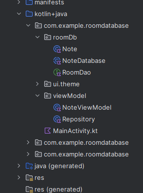

### Mainactivity.kt
```kotlin
package com.example.roomdatabase

import android.os.Bundle
import androidx.activity.ComponentActivity
import androidx.activity.compose.setContent
import androidx.activity.enableEdgeToEdge
import androidx.activity.viewModels
import androidx.compose.foundation.clickable
import androidx.compose.foundation.layout.Arrangement
import androidx.compose.foundation.layout.Column
import androidx.compose.foundation.layout.Spacer
import androidx.compose.foundation.layout.fillMaxSize
import androidx.compose.foundation.layout.fillMaxWidth
import androidx.compose.foundation.layout.height
import androidx.compose.foundation.layout.padding
import androidx.compose.foundation.lazy.LazyColumn
import androidx.compose.foundation.lazy.items
import androidx.compose.material3.Button
import androidx.compose.material3.Divider
import androidx.compose.material3.HorizontalDivider
import androidx.compose.material3.MaterialTheme
import androidx.compose.material3.Scaffold
import androidx.compose.material3.Surface
import androidx.compose.material3.Text
import androidx.compose.material3.TextField
import androidx.compose.runtime.Composable
import androidx.compose.runtime.getValue
import androidx.compose.runtime.mutableStateOf
import androidx.compose.runtime.remember
import androidx.compose.runtime.setValue
import androidx.compose.ui.Modifier
import androidx.compose.ui.tooling.preview.Preview
import androidx.compose.ui.unit.dp
import androidx.lifecycle.ViewModel
import androidx.lifecycle.ViewModelProvider
import androidx.lifecycle.viewmodel.CreationExtras
import androidx.room.Room
import com.example.roomdatabase.roomDb.Note
import com.example.roomdatabase.roomDb.NoteDatabase
import com.example.roomdatabase.ui.theme.RoomDatabaseTheme
import com.example.roomdatabase.viewModel.NoteViewModel
import com.example.roomdatabase.viewModel.Repository

@Suppress("UNREACHABLE_CODE")
class MainActivity : ComponentActivity() {
    private val db by lazy {
        Room.databaseBuilder(
            applicationContext,
            NoteDatabase::class.java,
            name = "note.db"
        ).build()
    }

    private val viewModel by viewModels<NoteViewModel> (
        factoryProducer = {
            object: ViewModelProvider.Factory{
                override fun <T : ViewModel> create(
                    modelClass: Class<T>,
                    extras: CreationExtras
                ): T {
                    return NoteViewModel(Repository(db)) as T
                }
            }
        }
    )
    override fun onCreate(savedInstanceState: Bundle?) {
        super.onCreate(savedInstanceState)
        enableEdgeToEdge()
        setContent {
            RoomDatabaseTheme {
                Surface(
                    modifier = Modifier.fillMaxSize(),
                    color = MaterialTheme.colorScheme.background
                ){
                    var name by remember {
                        mutableStateOf("")
                    }

                    var body by remember {
                        mutableStateOf("")
                    }

                    val note = Note(
                        name,
                        body
                    )

                    var noteList by remember{
                        mutableStateOf(listOf<Note>())
                    }
                    viewModel.getNotes().observe(this){
                        noteList = it
                    }


                    Column(
                        modifier = Modifier.padding(12.dp)
                    ) {

                        Spacer(modifier = Modifier.height(20.dp))

                        TextField(value = name, onValueChange = {name = it}, placeholder = {Text(
                            text = "name"
                        )})
                        Spacer(modifier = Modifier.height(20.dp))

                        TextField(value = body, onValueChange = {body = it}, placeholder = {Text(
                            text = "body"
                        )})

                        Spacer(modifier = Modifier.height(20.dp))

                        Button(onClick = {
                            viewModel.upsertNote(note)
                        }) {
                            Text(text = "set data")
                        }


                        LazyColumn {
                            items(noteList){
                                note ->
                                Column(Modifier.clickable {
                                    viewModel.deleteNote(note)
                                }) {
                                    Text(text= "Name: ${note.noteName}")
                                    Spacer(modifier = Modifier.height(8.dp))
                                    Text(text= "Body: ${note.noteBody}")
                                    HorizontalDivider(Modifier.fillMaxWidth().padding(6.dp))
                                }
                            }
                        }
                    }

                }
            }
        }
    }
}


@Composable
fun Greeting(name: String, modifier: Modifier = Modifier) {
    Text(
        text = "Hello $name!",
        modifier = modifier
    )
}

@Preview(showBackground = true)
@Composable
fun GreetingPreview() {
    RoomDatabaseTheme {
        Greeting("Android")
    }
}
```


### Repository.kt
```kotlin
package com.example.roomdatabase.viewModel

import androidx.room.Delete
import androidx.room.Query
import androidx.room.RoomDatabase
import androidx.room.Upsert
import com.example.roomdatabase.roomDb.Note
import com.example.roomdatabase.roomDb.NoteDatabase

class Repository(private val db : NoteDatabase) {


    suspend fun upsertNote(note: Note){
        db.dao.upsertNote(note)
    }


    suspend fun deleteNote(note: Note){
        db.dao.deleteNote(note)
    }


    fun getAllNotes() = db.dao.getAllNotes()
}
```


### NoteViewModel.kt

```kotlin
package com.example.roomdatabase.viewModel

import androidx.lifecycle.ViewModel
import androidx.lifecycle.asLiveData
import androidx.lifecycle.viewModelScope
import com.example.roomdatabase.roomDb.Note
import kotlinx.coroutines.launch

class NoteViewModel(private val repository: Repository): ViewModel() {

    fun getNotes() = repository.getAllNotes().asLiveData(viewModelScope.coroutineContext)

    fun upsertNote(note: Note){
        viewModelScope.launch {
            repository.upsertNote(note)
        }
    }

    fun deleteNote(note: Note){
        viewModelScope.launch {
            repository.deleteNote(note)
        }
    }
}
```


### Note.kt
```
package com.example.roomdatabase.roomDb

import androidx.room.Entity
import androidx.room.PrimaryKey


@Entity
data class Note(
    val noteName: String,
    val noteBody: String,
    @PrimaryKey(autoGenerate = true)
    val noteId: Int = 0
)
```


### RoomDao.kt
```
package com.example.roomdatabase.roomDb

import androidx.room.Dao
import androidx.room.Delete
import androidx.room.Query
import androidx.room.Upsert
import kotlinx.coroutines.flow.Flow


@Dao
interface RoomDao {
    @Upsert
    suspend fun upsertNote(note: Note)

    @Delete
    suspend fun deleteNote(note: Note)


    @Query("SELECT * FROM note")
    fun getAllNotes(): Flow<List<Note>>
}
```


### NoteDatabase.kt
```kotlin
package com.example.roomdatabase.roomDb

import androidx.room.Database
import androidx.room.RoomDatabase


@Database(
    entities = [Note::class],
    version = 1
)

abstract class NoteDatabase: RoomDatabase() {
    abstract val dao: RoomDao
}
```


