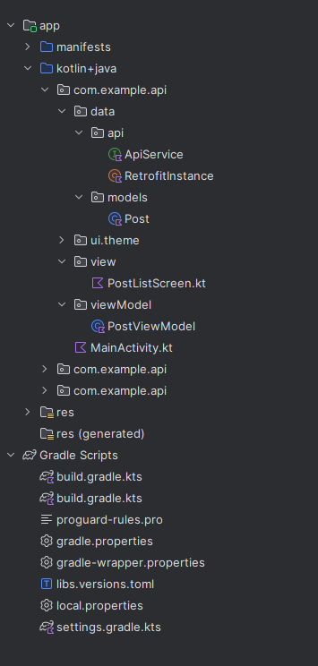

### ApiService.kt

```kotlin
package com.example.api.data.api

import com.example.api.data.models.Post
import retrofit2.http.GET

interface ApiService {
    @GET("posts")
    suspend fun getPosts(): List<Post>
}
```


### RetrofitInstance.kt
```kotlin
package com.example.api.data.api

import retrofit2.Retrofit
import retrofit2.converter.gson.GsonConverterFactory

object RetrofitInstance {
    val api: ApiService by lazy {
        Retrofit.Builder()
            .baseUrl("https://jsonplaceholder.typicode.com")
            .addConverterFactory(GsonConverterFactory.create())
            .build()
            .create(ApiService::class.java)
    }
}
```


### Post.kt
```kotlin
package com.example.api.data.models

data class Post(
    val id: String,
    val title: String,
    val body: String
)
```


### PostListScreen.kt
```kotlin
package com.example.api.view

import androidx.compose.foundation.layout.Arrangement
import androidx.compose.foundation.layout.Column
import androidx.compose.foundation.layout.PaddingValues
import androidx.compose.foundation.layout.fillMaxWidth
import androidx.compose.foundation.layout.padding
import androidx.compose.foundation.lazy.LazyColumn
import androidx.compose.foundation.lazy.items
import androidx.compose.material3.Card
import androidx.compose.material3.CardDefaults
import androidx.compose.material3.CircularProgressIndicator
import androidx.compose.material3.MaterialTheme
import androidx.compose.material3.Text
import androidx.compose.runtime.Composable
import androidx.compose.runtime.getValue
import androidx.compose.ui.Modifier
import androidx.compose.ui.graphics.Color
import androidx.compose.ui.unit.dp
import com.example.api.data.models.Post
import com.example.api.ui.theme.PurpleGrey40
import com.example.api.viewModel.PostViewModel


@Composable
fun PostListScreen(viewModel: PostViewModel = PostViewModel(), paddingValues: PaddingValues) {

    val posts by viewModel.posts

    if( posts.isEmpty()){
        CircularProgressIndicator()
    }
    else{

        LazyColumn(
            contentPadding = PaddingValues(16.dp),
            verticalArrangement = Arrangement.spacedBy(8.dp),
            modifier = Modifier.padding(paddingValues)
        ) {
            items(posts){
                PostCard(it)
            }
        }
    }
}


@Composable
fun PostCard(post: Post){
    Card(
        modifier = Modifier.fillMaxWidth(),
        colors = CardDefaults.cardColors(PurpleGrey40)
    ){
        Column(modifier = Modifier.padding(16.dp)){
            Text(text= "Post #${post.id}", style = MaterialTheme.typography.bodyLarge, color = Color.White)
            Text(text= post.title, style = MaterialTheme.typography.bodyMedium, color = Color.White)
            Text(text= post.body, style = MaterialTheme.typography.bodySmall, color = Color.White)
        }
    }
}
```


### PostViewModel.kt
```kotlin
package com.example.api.viewModel

import androidx.compose.runtime.State
import androidx.compose.runtime.mutableStateOf
import androidx.lifecycle.ViewModel
import com.example.api.data.models.Post
import androidx.lifecycle.viewModelScope
import com.example.api.data.api.RetrofitInstance
import kotlinx.coroutines.launch

class PostViewModel: ViewModel() {
    private val _posts = mutableStateOf<List<Post>>(emptyList())

    val posts: State<List<Post>> = _posts

    init {
        fetchPosts()
    }


    private fun fetchPosts(){
        viewModelScope.launch {
            try {
                _posts.value = RetrofitInstance.api.getPosts()
            }
            catch (e: Exception) {

            }
        }
    }
}
```


### MainActivity.kt
```kotlin
package com.example.api

import android.annotation.SuppressLint
import android.os.Bundle
import androidx.activity.ComponentActivity
import androidx.activity.compose.setContent
import androidx.activity.enableEdgeToEdge
import androidx.compose.foundation.layout.fillMaxSize
import androidx.compose.foundation.layout.padding
import androidx.compose.material3.Scaffold
import androidx.compose.material3.Text
import androidx.compose.runtime.Composable
import androidx.compose.ui.Modifier
import androidx.compose.ui.tooling.preview.Preview
import com.example.api.ui.theme.ApiTheme
import com.example.api.view.PostListScreen

class MainActivity : ComponentActivity() {
    @SuppressLint("UnusedMaterial3ScaffoldPaddingParameter")
    override fun onCreate(savedInstanceState: Bundle?) {
        super.onCreate(savedInstanceState)
        enableEdgeToEdge()
        setContent {
            ApiTheme {
                Scaffold(modifier = Modifier.fillMaxSize()) {
                    PostListScreen( paddingValues = it)
                }
            }
        }
    }
}

@Composable
fun Greeting(name: String, modifier: Modifier = Modifier) {
    Text(
        text = "Hello $name!",
        modifier = modifier
    )
}

@Preview(showBackground = true)
@Composable
fun GreetingPreview() {
    ApiTheme {
        Greeting("Android")
    }
}
```